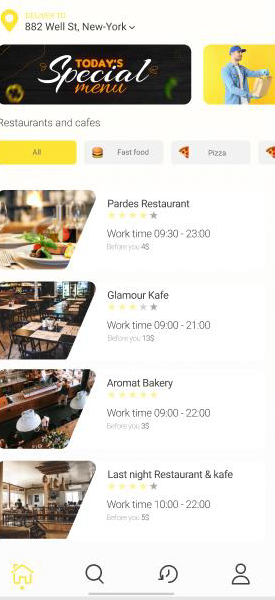
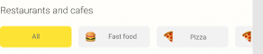
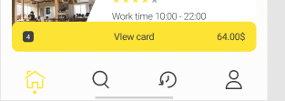

# Instalar dependencies y correr proyecto en Modo development y produccion
    - npm install
    - npm start
    - npm run build
# food-delivery

El siguiente proyecto busca validar los conocimientos adquiridos en el programa de Front-end 
con énfasis en ReactJS. A continuación, se describen los requerimientos 
técnicos para cumplir con el producto de esteproyecto:

1. Emplear las librerías JavaScript React-Redux Redux toolkit
2. Implementar el ciclo de Redux
3. Implementar Firebase Autentication para Login, Register (para usuarios que ingresen con email y contraseña), inicio de sesión con Google, Facebook y código de verificación para usuarios nuevos con número de teléfono o correo.
4. CRUD con Firestore (agregar, listar, editar, eliminar, también buscar) (NO USO DE API`S)
5. Realizar el Deploy con Firebase.
6. Uso de rutas públicas y privadas (protección de rutas)
7. Cumplir con los estilos del mockup proporcionado, implementando un framework CSS deseado.
8. Implementar diseño responsive
9. Implementar Clodinary para cargar imágenes
10. En la página home, debe presentar funcional un carrusel con imágenes, dirección registrada del usuario logueado y listarse todos los restaurantes.

11. Al dar click sobre una card de restaurante, debe redireccionar a la página de detalle del restaurantes.
12. Los botones de navegación en la parte inferior de la página, deben ser funcionales y redireccionar a las diferentes páginas: home, búsqueda, órdenes realizadas y perfil del usuario.

13. Se debe realizar filtrado por categoría de restaurante.

14. En la página de búsqueda, se debe realizar la búsqueda por nombre del plato y mostrar el resultado de la búsqueda mediate cards con imagen, nombre, restaurante y precio de cada plato. Al dar click sobre una card, debe redireccionar al usuario a la página de detalles del plato.
15. En la página de órdenes deben listarse el historial de las órdenes realizadas por el usuario con la información del estado (recibida, en proceso, enviada y entregada) y valor total de cada orden. Al dar click sobre una orden, debe redireccionar a la página de detalles de la orden correspondiente, donde sea posible cancelar una orden enviada o en proceso.
16. En la página de la información del perfil de usuario, debe ser posible la edición de los datos personales y métodos de pago.
17. En la página de detalles de restaurantes, se debe listar nombre, descripción, estrellas, horario y menú del restaurante. Deben estar funcionales los botones de filtrado por categoría de platos. Al dar click sobre una card del menú, debe redireccionar a la página de detalles del plato correspondiente.
18. En la página de detalles de cada plato, debe ser posible agregar o eliminar ingredientes, variar la cantidad del platillo y mostrar el valor total. AL dar click en el botón Add, debe redireccionar a la página de nueva orden, donde sea posible modificar la cantidad o eliminar platos a comprar, método de pago, agregar notas al restaurante y crear la nueva orden. Cuando la nueva orden se haya generado debe devolver al usuario a la página home y mostrarle la siguiente card:

19. Debe existir un tipo de usuario administrador, el cual desde una nueva interfaz pueda crear, modificar, eliminar restaurantes y platos, e igualmente pueda cambiar el estado de una orden.
20. No es necesario la implementación de las pantallas de soporte, faq, language, geolocalización, stepers iniciales, no internet connection ni Chat with specialist.
21. Cualquier funcionalidad desarrollada que no esté especificada en los requerimientos mínimos, se tendrá en cuenta como bonificación.

Requerimientos:
1. Uso de Firebase y Firestore
2. Usuario que cree una cuenta por email y contraseña, debe poder subir una foto de perfil.
3. Protección de Rutas
4. Enrutamiento dinámico,
5. Uso de Cloudinary
6. Aplicación de test unitarios (al menos realizar 5 test)

Las entregas del proyecto se van a dividir de la siguiente manera:
1. Que el Usuario pueda crear una nueva cuenta, iniciar sesión, luego dirigirlo a la página Home, donde se listan los restaurantes y al dar click sobre una card de restaurantes se redireccione a la página de detalles del restaurante. El usuario también debe poder actualizar sus datos de perfil (dirección, método de pago, foto de perfil, etc). Fecha de entrega: 11 de noviembre del 2022.
2. Que el usuario pueda crear una nueva orden, visualizarla y modificarla. Fecha de entrega: 11 de noviembre del 2022.
3. Que el usuario pueda buscar por nombre de platos en la página de búsqueda y filtrar por categoría con los botones de la página Home y página de detalles de un restaurante. Fecha de entrega: 18 de noviembre del 2022.
4. Que el usuario administrador pueda observar las órdenes por cada restaurante y modificar el estado de una orden que esté recibida, en proceso o enviada. Fecha de entrega: 18 de noviembre del 2022.
